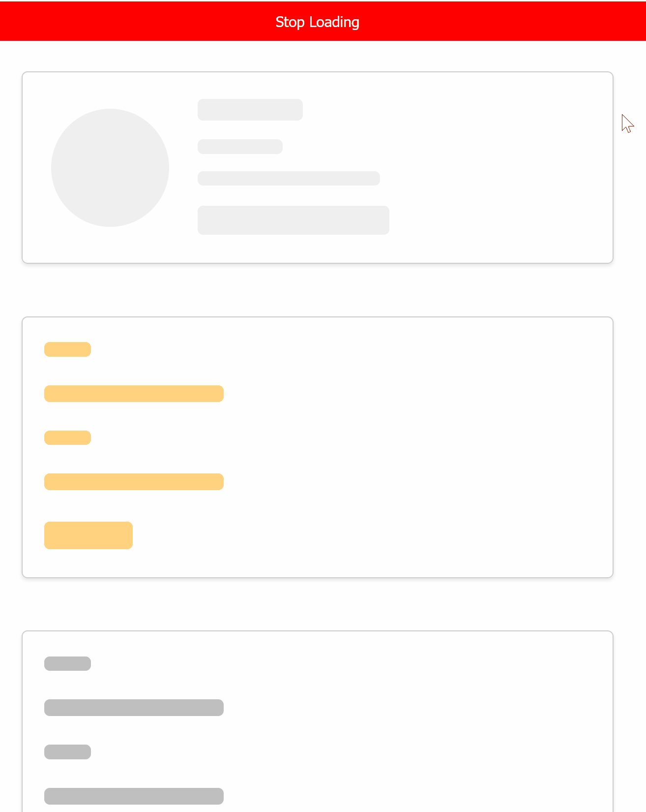

# React Pulsable

This is a simple react component that can be used to wrap other components and add a pulsing/skeleton effect to them.

[Demo Link](https://k7fdzw.csb.app/)



## Example 1

```jsx
import React, { useState } from 'react';
import Pulsable from 'react-pulsable';
import 'react-pulsable/index.css';

const App = () => {
  const [isLoading, setIsLoading] = useState(true);

  const formStyle = {
    backgroundColor: 'lightblue',
    padding: '20px',
    borderRadius: '5px',

    display: 'flex',
    flexDirection: 'column',
    gap: '8px',
    alignItems: 'flex-start',
  };

  return (
    <div
      style={{
        display: 'flex',
        flexDirection: 'column',
        gap: '8px',
        alignItems: 'flex-start',
      }}
    >
      <Pulsable isLoading={isLoading} backgroundColor="red">
        <div>
          <h1>React Form with Pulsable</h1>
          <form style={formStyle}>
            <label htmlFor="name" className="pulsable">
              Name:
            </label>
            <div className="pulsable">
              <input type="text" id="name" style={{ width: '100%' }} />
            </div>

            <label htmlFor="email" className="pulsable">
              Email:
            </label>
            <div className="pulsable" disabled>
              <input type="email" id="email" style={{ width: '100%' }} />
            </div>

            <button
              className="pulsable"
              type="submit"
              style={{
                backgroundColor: 'blue',
                color: 'white',
                padding: '10px 20px',
                border: 'none',
                borderRadius: '5px',
                cursor: 'pointer',
              }}
            >
              Submit
            </button>
          </form>
        </div>
      </Pulsable>

      <button
        onClick={() => setIsLoading((s) => !s)}
        className="pulsable"
        style={{
          backgroundColor: 'blue',
          color: 'white',
          padding: '10px 20px',
          border: 'none',
          borderRadius: '5px',
          cursor: 'pointer',
        }}
      >
        {isLoading ? 'Stop Loading' : 'Start Loading'}
      </button>
    </div>
  );
};

export default App;
```

## Usage Guide

The component takes two props:
- `isLoading`: a boolean that indicates whether the component should be pulsing or not.
- `backgroundColor`: a string that indicates the background color of the pulsing effect. It can be any valid css color value.

### Conditions:

- You must wrap the component you want to add the pulsing effect to with the `Pulsable` component.
- You must provide isLoading state to the `Pulsable` component.
- You can use the `className="pulsable"` to add the pulsing effect to any element.
- if your component is a self closing tag like `` you should have to wrap it with div and add pulsable class to that. 

#### Example 2

```jsx
<div className="pulsable">
  <input type="text" id="name" style={{ width: '100%' }} />
</div>
```

- As Shown infor better performance you can use `flex` and  `align-items: flex-start` in parentNode to avoid the pulsing effect from stretching the component. As shown in example 1. you can also add these styles conditionally wihile loading, if it's affecting your design.

